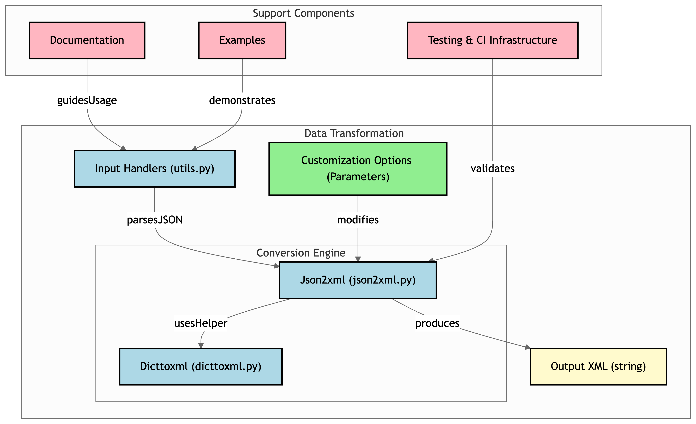

========
json2xml
========

.. image:: https://badge.fury.io/py/json2xml.svg
.. image:: https://static.pepy.tech/personalized-badge/json2xml?period=total&units=international_system&left_color=blue&right_color=orange&left_text=Downloads
        :target: https://pepy.tech/project/json2xml

.. image:: https://github.com/vinitkumar/json2xml/actions/workflows/pythonpackage.yml/badge.svg
.. image:: https://img.shields.io/pypi/pyversions/json2xml.svg
.. image:: https://readthedocs.org/projects/json2xml/badge/?version=latest
        :target: https://json2xml.readthedocs.io/en/latest/?badge=latest
        :alt: Documentation Status
.. image:: https://codecov.io/gh/vinitkumar/json2xml/branch/master/graph/badge.svg?token=Yt2h55eTL2
      :target: https://codecov.io/gh/vinitkumar/json2xml

json2xml is a Python library that allows you to convert JSON data into XML format. It's simple, efficient, and easy to use.

Documentation: https://json2xml.readthedocs.io.

The library was initially dependent on the `dict2xml` project, but it has now been integrated into json2xml itself. This has led to cleaner code, the addition of types and tests, and overall improved performance.

**Looking for a Go version?** Check out `json2xml-go <https://github.com/vinitkumar/json2xml-go>`_, a Go port of this library with identical features and a native CLI tool.

Architecture Diagram
^^^^^^^^^^^^^^^^^^^^

Installation
^^^^^^^^^^^^

**As a Library**

.. code-block:: console

    pip install json2xml

**With Native Rust Acceleration (29x faster)**

For maximum performance, install the optional Rust extension:

.. code-block:: console

    # Install json2xml with Rust acceleration (when published)
    pip install json2xml[fast]
    
    # Or install the Rust extension separately
    pip install json2xml-rs

The Rust extension provides **29x faster** conversion compared to pure Python. It's automatically used when available, with seamless fallback to pure Python.

*Note: The ``json2xml-rs`` package will be available on PyPI after the first Rust release.*

**As a CLI Tool**

The library includes a command-line tool ``json2xml-py`` that gets installed automatically:

.. code-block:: console

    pip install json2xml

    # Now you can use it from the command line
    json2xml-py data.json
    json2xml-py -s '{"name": "John", "age": 30}'
    json2xml-py -u https://api.example.com/data.json

For CLI options, run ``json2xml-py --help``.

Features
^^^^^^^^

json2xml supports the following features:

* Conversion from a `json` string to XML
* Conversion from a `json` file to XML
* Conversion from an API that emits `json` data to XML
* Compliant with the `json-to-xml` function specification from `XPath 3.1 <https://www.w3.org/TR/xpath-functions-31/#func-json-to-xml>`_
* **Command-line tool** for easy conversion from the terminal

Usage
^^^^^

You can use the json2xml library in the following ways:

.. code-block:: python

    from json2xml import json2xml
    from json2xml.utils import readfromurl, readfromstring, readfromjson

    # Convert JSON data from a URL to XML
    data = readfromurl("https://api.publicapis.org/entries")
    print(json2xml.Json2xml(data).to_xml())

    # Convert a JSON string to XML
    data = readfromstring(
        '{"login":"mojombo","id":1,"avatar_url":"https://avatars0.githubusercontent.com/u/1?v=4"}'
    )
    print(json2xml.Json2xml(data).to_xml())

    # Convert a JSON file to XML
    data = readfromjson("examples/licht.json")
    print(json2xml.Json2xml(data).to_xml())

Custom Wrappers and Indentation
^^^^^^^^^^^^^^^^^^^^^^^^^^^^^^^

By default, a wrapper `all` and pretty `True` is set. However, you can easily change this in your code like this:

.. code-block:: python

    from json2xml import json2xml
    from json2xml.utils import readfromurl, readfromstring, readfromjson

    data = readfromstring(
        '{"login":"mojombo","id":1,"avatar_url":"https://avatars0.githubusercontent.com/u/1?v=4"}'
    )
    print(json2xml.Json2xml(data, wrapper="all", pretty=True).to_xml())

Outputs this:

.. code-block:: xml

    <?xml version="1.0" encoding="UTF-8"?>
    <all>
      <login type="str">mojombo</login>
      <id type="int">1</id>
      <avatar_url type="str">https://avatars0.githubusercontent.com/u/1?v=4</avatar_url>
    </all>

Omit List item
^^^^^^^^^^^^^^

Assume the following json input

.. code-block:: json

    {
      "my_items": [
        { "my_item": { "id": 1 } },
        { "my_item": { "id": 2 } }
      ],
      "my_str_items": ["a", "b"]
    }

By default, items in an array are wrapped in <item></item>.

Default output:

.. code-block:: xml

    <?xml version="1.0" ?>
    <all>
      <my_items type="list">
        <item type="dict">
          <my_item type="dict">
            <id type="int">1</id>
          </my_item>
        </item>
        <item type="dict">
          <my_item type="dict">
            <id type="int">2</id>
          </my_item>
        </item>
      </my_items>
      <my_str_items type="list">
        <item type="str">a</item>
        <item type="str">b</item>
      </my_str_items>
      <empty type="list"/>
    </all>

However, you can change this behavior using the item_wrap property like this:

.. code-block:: python

    from json2xml import json2xml
    from json2xml.utils import readfromurl, readfromstring, readfromjson

    data = readfromstring('{"my_items":[{"my_item":{"id":1} },{"my_item":{"id":2} }],"my_str_items":["a","b"]}')
    print(json2xml.Json2xml(data, item_wrap=False).to_xml())

Outputs this:

.. code-block:: xml

    <?xml version="1.0" ?>
    <all>
      <my_items type="list">
        <my_item type="dict">
          <id type="int">1</id>
        </my_item>
        <my_item type="dict">
          <id type="int">2</id>
        </my_item>
      </my_items>
      <my_str_items type="str">a</my_str_items>
      <my_str_items type="str">b</my_str_items>
    </all>

Optional Attribute Type Support
^^^^^^^^^^^^^^^^^^^^^^^^^^^^^^^

You can also specify if the output XML needs to have type specified or not. Here is the usage:

 .. code-block:: python

     from json2xml import json2xml
     from json2xml.utils import readfromurl, readfromstring, readfromjson

     data = readfromstring(
         '{"login":"mojombo","id":1,"avatar_url":"https://avatars0.githubusercontent.com/u/1?v=4"}'
     )
     print(json2xml.Json2xml(data, wrapper="all", pretty=True, attr_type=False).to_xml())

Outputs this:

.. code-block:: xml

     <?xml version="1.0" ?>
     <all>
       <login>mojombo</login>
       <id>1</id>
       <avatar_url>https://avatars0.githubusercontent.com/u/1?v=4</avatar_url>
     </all>

XPath 3.1 Compliance Options
^^^^^^^^^^^^^^^^^^^^^^^^^^^^^

The library supports the optional `xpath_format` parameter which makes the output compliant with the `json-to-xml` function specification from `XPath 3.1 <https://www.w3.org/TR/xpath-functions-31/#func-json-to-xml>`_. When enabled, the XML output follows the standardized format defined by the W3C specification.

.. code-block:: python

     from json2xml import json2xml
     from json2xml.utils import readfromstring

     data = readfromstring(
         '{"login":"mojombo","id":1,"avatar_url":"https://avatars0.githubusercontent.com/u/1?v=4"}'
     )
     # Use xpath_format=True for XPath 3.1 compliant output
     print(json2xml.Json2xml(data, xpath_format=True).to_xml())

The methods are simple and easy to use and there are also checks inside of code to exit cleanly
in case any of the input(file, string or API URL) returns invalid JSON.

Development
^^^^^^^^^^^

This project uses modern Python development practices. Here's how to set up a development environment:

 .. code-block:: console

    # Create and activate virtual environment (using uv - recommended)
    uv venv
    source .venv/bin/activate  # On Windows: .venv\Scripts\activate
    
    # Install dependencies
    uv pip install -r requirements-dev.txt
    uv pip install -e .

**Running Tests and Checks**

We provide several ways to run tests and quality checks:

Using Make (recommended):

 .. code-block:: console

    make test          # Run tests with coverage
    make lint          # Run linting with ruff
    make typecheck     # Run type checking with mypy
    make check-all     # Run all checks (lint, typecheck, test)

Using the development script:

 .. code-block:: console

    python dev.py          # Run all checks
    python dev.py test     # Run tests only
    python dev.py lint     # Run linting only
    python dev.py typecheck # Run type checking only

Using tools directly:

 .. code-block:: console

    pytest --cov=json2xml --cov-report=term -xvs tests -n auto
    ruff check json2xml tests
    mypy json2xml tests

**Rust Extension Development**

The optional Rust extension (``json2xml-rs``) provides 29x faster performance. To develop or build the Rust extension:

Prerequisites:

 .. code-block:: console

    # Install Rust (if not already installed)
    curl --proto '=https' --tlsv1.2 -sSf https://sh.rustup.rs | sh
    
    # Install maturin (Rust-Python build tool)
    uv pip install maturin

Building the extension:

 .. code-block:: console

    # Development build (installs in current environment)
    cd rust
    uv pip install -e .
    
    # Or using maturin directly
    maturin develop --release
    
    # Production wheel build
    maturin build --release

Running Rust benchmarks:

 .. code-block:: console

    # After building the extension
    python benchmark_rust.py

The Rust code is in ``rust/src/lib.rs`` and uses PyO3 for Python bindings.

CLI Usage
^^^^^^^^^

The ``json2xml-py`` command-line tool provides an easy way to convert JSON to XML from the terminal.

**Basic Examples**

.. code-block:: console

    # Convert a JSON file to XML
    json2xml-py data.json

    # Convert with custom wrapper element
    json2xml-py -w root data.json

    # Read JSON from string
    json2xml-py -s '{"name": "John", "age": 30}'

    # Read from stdin
    cat data.json | json2xml-py -

    # Output to file
    json2xml-py -o output.xml data.json

    # Use XPath 3.1 format
    json2xml-py -x data.json

    # Disable pretty printing and type attributes
    json2xml-py --no-pretty --no-type data.json

**CLI Options**

.. code-block:: text

    Input Options:
      -u, --url string        Read JSON from URL
      -s, --string string     Read JSON from string
      [input-file]            Read JSON from file (use - for stdin)

    Output Options:
      -o, --output string     Output file (default: stdout)

    Conversion Options:
      -w, --wrapper string    Wrapper element name (default "all")
      -r, --root              Include root element (default true)
      -p, --pretty            Pretty print output (default true)
      -t, --type              Include type attributes (default true)
      -i, --item-wrap         Wrap list items in <item> elements (default true)
      -x, --xpath             Use XPath 3.1 json-to-xml format
      -c, --cdata             Wrap string values in CDATA sections
      -l, --list-headers      Repeat headers for each list item

    Other Options:
      -v, --version           Show version information
      -h, --help              Show help message

Go Version
^^^^^^^^^^

A Go port of this library is available at `json2xml-go <https://github.com/vinitkumar/json2xml-go>`_.

**Install the Go CLI:**

.. code-block:: console

    go install github.com/vinitkumar/json2xml-go/cmd/json2xml@latest

The Go version provides the same features and a native compiled binary for maximum performance.

Rust Extension (PyO3)
^^^^^^^^^^^^^^^^^^^^^

For users who need maximum performance within Python, json2xml includes an optional native Rust extension built with PyO3:

.. code-block:: console

    pip install json2xml[fast]

**Rust vs Pure Python Performance:**

.. list-table::
   :header-rows: 1
   :widths: 30 20 20 15

   * - Test Case
     - Pure Python
     - Rust Extension
     - Speedup
   * - **Small JSON** (47 bytes)
     - 41µs
     - 1.3µs
     - **33x**
   * - **Medium JSON** (3.2 KB)
     - 2.1ms
     - 76µs
     - **28x**
   * - **Large JSON** (32 KB)
     - 21.5ms
     - 727µs
     - **30x**
   * - **Very Large JSON** (323 KB)
     - 215ms
     - 7.4ms
     - **29x**

**Usage with Rust Extension:**

.. code-block:: python

    # Automatic backend selection (recommended)
    from json2xml.dicttoxml_fast import dicttoxml, get_backend

    print(f"Using backend: {get_backend()}")  # 'rust' or 'python'
    
    data = {"name": "John", "age": 30}
    xml_bytes = dicttoxml(data)

The ``dicttoxml_fast`` module automatically uses the Rust backend when available and falls back to pure Python for unsupported features (like ``xpath_format``, ``xml_namespaces``, or custom ``item_func``).

**Platform Support:**

Pre-built wheels are available for:

- Linux (x86_64, aarch64)
- macOS (x86_64, arm64/Apple Silicon)
- Windows (x86_64)

For other platforms, the pure Python version is used automatically.

Performance Benchmarks
^^^^^^^^^^^^^^^^^^^^^^

Comprehensive benchmarks comparing Python, Go, and Zig implementations:

.. list-table::
   :header-rows: 1
   :widths: 25 20 15 15

   * - Test Case
     - Python (CPython)
     - Go
     - Zig
   * - **Small JSON** (47 bytes)
     - 68.88ms
     - 7.13ms
     - 2.65ms
   * - **Medium JSON** (2.6 KB)
     - 73.40ms
     - 4.85ms
     - 2.13ms
   * - **Large JSON** (323 KB)
     - 420.06ms
     - 68.88ms
     - 5.90ms
   * - **Very Large JSON** (1.6 MB)
     - 2.08s
     - 288.75ms
     - 20.62ms

**Recommendation by Use Case:**

- **Python integration / scripting**: Use this library (json2xml)
- **CLI tool / moderate performance**: Use `json2xml-go <https://github.com/vinitkumar/json2xml-go>`_
- **Maximum performance / large files**: Use `json2xml-zig <https://github.com/vinitkumar/json2xml-zig>`_

For detailed benchmarks, see `BENCHMARKS.md <https://github.com/vinitkumar/json2xml/blob/master/BENCHMARKS.md>`_.

Other Implementations
^^^^^^^^^^^^^^^^^^^^^

This library is also available in other languages:

- **Go**: `json2xml-go <https://github.com/vinitkumar/json2xml-go>`_ - 7x faster, native compiled binary
- **Zig**: `json2xml-zig <https://github.com/vinitkumar/json2xml-zig>`_ - 85x faster, maximum performance

Help and Support to maintain this project
^^^^^^^^^^^^^^^^^^^^^^^^^^^^^^^^^^^^^^^^^

- You can sponsor my work for this plugin here: https://github.com/sponsors/vinitkumar/

