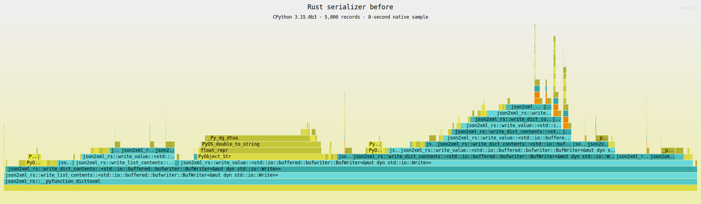
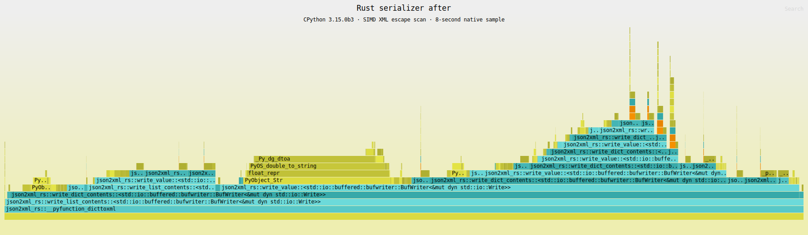
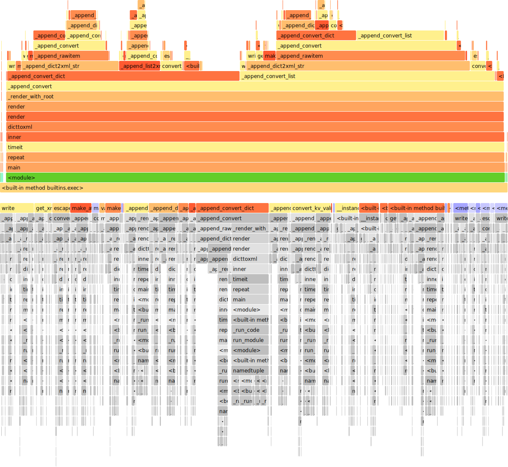
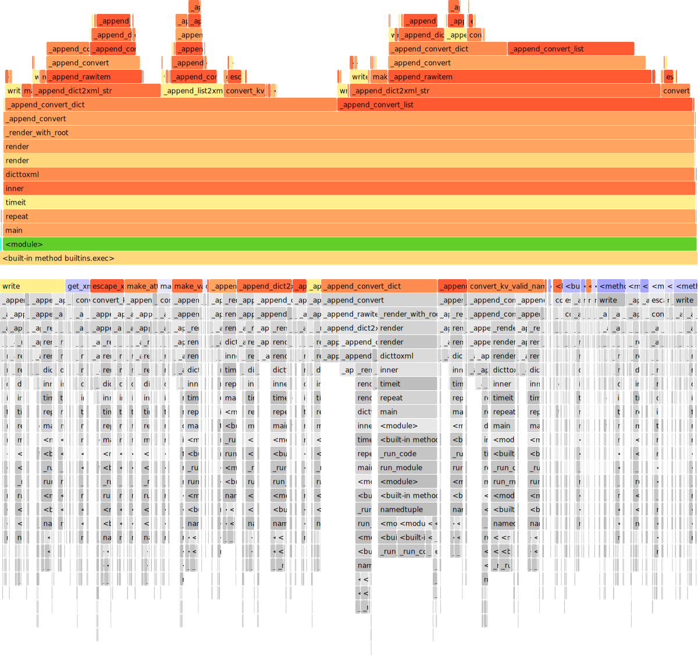

# Serializer flamegraphs

## Rust accelerator

These profiles compare the Rust serializer before and after vectorized XML escape-byte scanning on CPython 3.15.0b3.

The workload serializes a deterministic 5,000-record nested payload with type attributes enabled. Samply captured symbolized native stacks for eight seconds, and Inferno rendered the SVG flamegraphs. A separate paired release benchmark used 21 rounds of 50 conversions.

| Metric | Before | After | Change |
| --- | ---: | ---: | ---: |
| Median conversion | 6.007 ms | 5.632 ms | 6.23% lower |
| Mean conversion | 6.013 ms | 5.643 ms | 6.14% lower |
| Escape scanner exclusive samples | 14.31% | 7.97% | 44.3% lower share |

### Rust before

### Rust after

### Output buffer capacity

A post-optimization sweep tested 4, 8, 16, 32, 64, and 128 KiB capacities. The useful range plateaued at 16–64 KiB; an ABBA-interleaved 16-vs-32 KiB confirmation measured 5.974 ms versus 6.024 ms median, so the existing 16 KiB capacity remains the best measured choice without increasing per-call memory.

## Pure Python serializer

These profiles compare the pure-Python serializer before and after native JSON type fast paths on CPython 3.15.0b3.

The workload serializes a deterministic 5,000-record nested payload 20 times with type attributes enabled. Python 3.15's tracing profiler captured the call tree, and FlameProf rendered the SVGs.

| Profile | Traced time | Function calls | `isinstance` calls |
| --- | ---: | ---: | ---: |
| Before | 8.311 s | 48.17 million | 11.70 million |
| After | 5.782 s | 30.13 million | 2.80 million |

### Python before

### Python after

